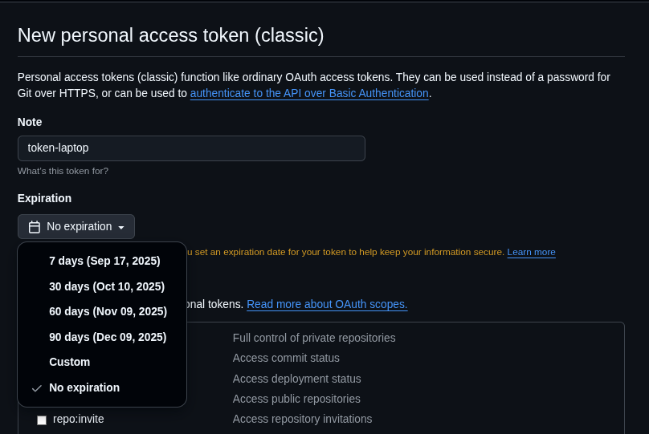
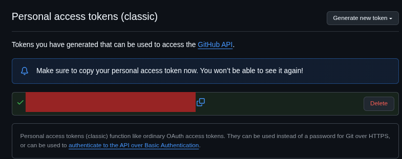

# 🚀 Introducción a Git - Sesión 1

## 📋 Descripción

En esta carpeta (directorio) se encuentra el material de la **primera sesión** del taller de GIT.

En esta clase, se abordaron los conceptos básicos y necesarios sobre git y sus comandos, así como como trabajar en ramas y la creación de un repositorio remoto en [GitHub](https://github.com/).

> **📎 Adjunto :** Se incluye la diapositiva usada en la sesión [diapositiva](diapositivas-primera-sesion.pdf)

---

## 📚 Temas tratados

Durante la sesión se cubrieron los siguientes temas:

- ¿Qué es Git y para que se usa?
- Comandos básicos
- Diferencias entre Git y GitHub-GitLab
- Diferencias entre GitHub y GitLab
- Conceptos de GitFlow
- Creación de un repositorio remoto en GitHub

---

## 🛠️ Creación de un repositorio remoto en GitHub

En esta sección se detalla el paso a paso de la creación de un repositorio en GitHub desde 0.

> **📌 Nota:**
> La creación y navegacón del flujo se hará mediante `HTTPS` y no así por `SSH`.

### ✅ Precondiciones

- Tener instalado Git en tu máquina, puedes revisar la documentación [aquí](https://docs.github.com/es/get-started/git-basics/set-up-git).
- Además de ya haber realizado la configuración de tu usuario y email asociado a tu cuenta de GitHub, los puedes modificar con estos comandos:
  ```bash
  git config --global user.name "tu_nombre"
  git config --global user.email "tu_correo"
  ```

### 🏗️ Crear repositorio remoto en GitHub

1. Ve a [github.com](https://github.com/), dirigete a tu cuenta a la sección `Repositories`.
2. Click en `New`.
3. Debes elegir un nombre, además decidir si quieres que sea público para otras personas o privado. Puedes dejar el resto por defecto (sin README, `.gitignore`, etc).
4. Y después click en **Create repository**

### 🔗 Conectar repositorio local al repositorio remoto en GitHub (mediante https)

1. Después de haber creado el repositorio remoto, solo se debe seguir los pasos que GitHub nos brinda:

```bash
…or create a new repository on the command line
echo "# prueba" >> README.md //omitir paso*
git init
git add README.md //omitir paso*
git commit -m "first commit" //omitir paso*
git branch -M main
git remote add origin https://github.com/user/prueba.git
git push -u origin main
```

### 🚨 Errores comúnes y soluciones al crear un repositorio remoto

#### Error al crear la conexión entre los repositorios:

Si es la primera vez que creamos un repositorio remoto en GitHub, al momento de realizar la conexión (`push`) del repositorio local al remoto, nos sale este error ⚠️:

```bash
git push -u origin main
error: src refspec main no concuerda con ninguno
error: falló el empuje de algunas referencias a 'https://github.com/user/prueba.git'
```

> Este error se debe a que nuestra rama actual `main` no tiene al menos un `commit`, ocasionando ese error. Entonces, porqué nos saltamos ese paso??. Nos saltamos ese paso para evitar `ensuciar` el historial de commits.

#### 💡 Solución

Para poder realizar la conexión y no ensuciar el historial de commits en el proceso. Se debe agregar un `commit vacío` que solo haga referencia a la creación o conexión/sincronización con el repo remoto:

```bash
git commit --allow-empty -m "Creación del repositorio"
```

Si unimos este nuevo paso con la configuación dada por GitHub y los pasos omitidos, los pasos para crear un repositorio sin errores es el siguiente:

```bash
git init
git commit --allow-empty -m "Creación del repositorio"
git branch -M main
git remote add origin https://github.com/user/prueba.git
git push -u origin main
```

---

#### 2. Error al sincronizar los datos de usuario:

Si al hacer `push` se te pide autenticar tus datos de GitHub, y tras introducir correctamente tus credenciales aparece el siguiente error ⚠️:

```bash
git push -u origin main
Username for 'https://github.com': user123 Password for 'https://user@github.com': ****
remote: Invalid username or token. Password authentication is not supported for Git operations. fatal: Autenticación falló para 'https://github.com/user/prueba.git/'
```

> Esto se debe a que, desde el **2021**, GitHub deshabilitó el uso de **contraseñas** para operaciones como **git push, clone, etc.**, vía **HTTPS**. Actualmente, solo acepta la autenticación de usuarios mediante:
> **SSH o Tokens de Acceso Personal (PAT)**

#### 💡 Solución

Para poder autenticarnos y obtener acceso, debemos crear un token de acceso personal (PAT).

- Ve a https://github.com/settings/tokens
- Haz click en `"Generate new token (classic)"`
  
- Dale nombre al token y selecciona su tiempo de expiración. (ej: 30 días o "no expiration")
  
- Marca los permisos necesarios para ese token. Para Git básico:
  - `repo` (para acceso a tus repositorios).
  - `workflow` (si vas a usar acciones de GitHub más adelante o en otros proyectos).
- Con los permisos ya seleccionados. Haz click en **"Generate token"**
- Y copia el token generado. **Ten cuidado que se muestra solo una vez**. 
- La próxima vez que hagas `git push` o `git pull`, Git te pedirá:
  ```bash
  Username for 'https://github.com': tu_usuario
  Password for 'https://github.com': tu_token //pega el token generado en el anterior paso
  ```
- Para evitar que Git te pida el usuario y token cada vez que quieras interactuar con el repositorio remoto, puedes guardar 💾 la configuración de las credenciales con:
  ```bash
  git config --global credential.helper store
  ```

---

## 📖 Material de Apoyo

- 📚 [Guía oficial de Git](https://git-scm.com/doc)
- 🐙 [GitHub Docs](https://docs.github.com/es)

---

## 👨‍💻 Autor - Facilitador

- [Neil Graneros Flores](https://github.com/reveluv1814)

---

`🇧🇴 La Paz - Bolivia 2025`
